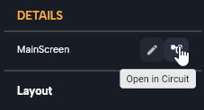
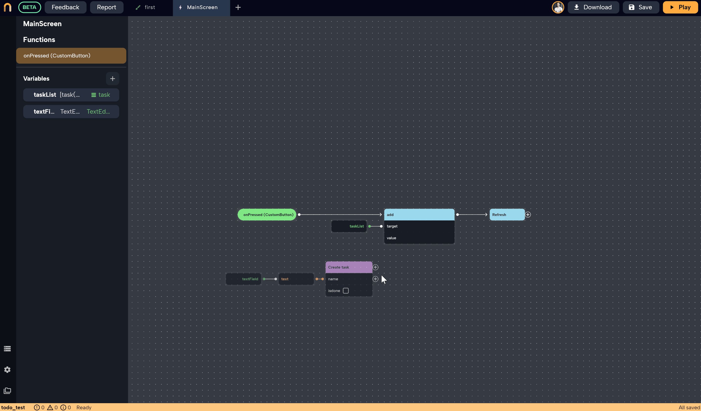

# Intro to Circuit

*In this section, you will learn:*
```

1. What is Circuit, and how it works?
2. Learn about the fundamentals of using it to create your logic 
3. Lean about different types of node connections
```

In this guide, we will walk you through the basics of working with **Circuit**, a powerful visual editor designed to simplify logic creation in a fast and intuitive manner while maintaining full control over details. Let's see how it works: 

## What is Circuit?

Circuit is a visual editor that allows you to design your logic flow in detail, giving you full control over the process without worrying about code syntax, structure, or placement. It enables you to focus entirely on your logic while providing a more enjoyable experience, and hence you will be much more creative in thinking and designing your logic with Circuit.

## Opening Circuit

Each screen or component file consists of a UI design and its associated logic. To open Circuit, click on any widget property that requires logic, such as the **On Pressed** field for buttons, or simply select any screen or component and click on the **Open in Circuit** icon in the top-right corner of the details panel. This will display all the logic graphs for that screen or component.




## Node Types and Connections

There are two types of connections between nodes:

1.  **Flow**: Determines the order of execution, indicating which node will be executed before another. The flow line is connected to the top of the node.
2.  **Input/Output**: These connections are used to pass data between nodes, such as variables or values.

## Connecting Nodes

To connect a node, hold it and drag it close to where you want to connect it. Notice that when holding a node, the pins will light up to help you connect to the correct type (each type has a color, e.g., a pin that accepts the value of type string will light red, a pin for connecting the flow will light white). You should connect the pins with the same type. When you get a node close to another node and the types match correctly, the pins that will connect will light up stronger, indicating that if you drop the node there, you will get a successful connection between those two pins.




#### Conditional Nodes

Conditional nodes, like "if" statements, control the flow of logic based on a specific condition. These nodes have three output pins for controlling the flow of logic. More on using the "if" statement will come later in the variable section.

## Adding Nodes

To add a node, right-click on an empty space on the board to add a top-level node such as "navigate," or click on the "+" button next to an existing node. This will display options for that specific node beside the top-level nodes. For example, if you have a variable node, clicking on "+" next to it will show options to perform operations on that variable, such as trimming, converting it to another type, etc.


:::info
You can wrap any widget with a Gesture Detector wrapper to make it pressable and add the option of adding logic to a click event for that widget. This provides a convenient way to create interactive UI elements in your app. For more, check out [Wrappers](../ui/wrappers/wrappers_intro.md)
:::


