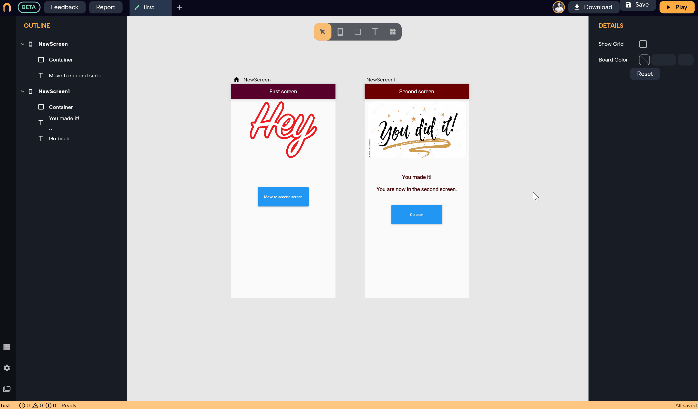

*In this section, you will learn:*
```
1. How to navigate between screens
2. How to add action to a button clicking
3. How to move data betwen the screens
```

One of the fundamental things to do with Circuit in Nowa is to navigate between screens in your app. You can use the **navigate** node to move to another screen when an event is triggered, such as clicking on a button, and a **back** node to return to the previous screen.

## Navigating to Another Screen

Consider an example where you have an app with two screens and a button on the main screen that takes you to the other screen, and another button to bring you back. To make it work:

1.  Select the button and click on the **+** button next to the **On Pressed** field in the details panel to add an action that will be executed when the button is pressed.
2.  The Circuit board will open with a default **On Pressed** node, which is the starting point of the logic flow.
3.  Right-click anywhere on the board, or click on the **+** button next to the **On Pressed** node. Head to the **Nowa** section in the popup and choose **Navigate**.
4.  In the **Navigate** node, choose the screen name you want to navigate to (e.g., **NewScreen1**). For more information on changing screen names, check out [Creating Screens](../ui/screens/create_screens.md).
5.  When you press the play button and click on the button, the app will navigate to the specified screen.
6. To add a back functionality to the button in the second screen, follow the same process but choose the **Back** node instead of the **Navigate** node.




---


## Passing Variables between Screens

If you have public variables for the screen you want to navigate to, input pins for each variable will be shown when selecting the screen name in the **Navigate** node. You can pass the initial value for those variables from the current screen by:

1.  Connecting the variables of the current screen to those pins.
2.  Typing the values directly if they are numbers or strings.
3.  Creating a new instance of an object if the type is a custom object.

You can also leave the input pins empty, and the values of the variables will be their default values set during creation. For more information, check out [Creating Local Variables](../variables/local_variables/var_vs_param.md)

#### An Example from a news app use case
In this example, we have a news app with two screens: the first screen displays a list of news cards, and the second screen shows the details of the news item that the user clicks on.

To achieve this, we add an **On Pressed** event to the card placeholder by wrapping it with the **Gesture Detector** wrapper. The variables visible in the Circuit board under the **Locals** section are all the variables accessible to that specific widget. In this case, the card placeholder receives an object called **element** from the **Group (row)** it belongs to for one particular news item to display. This element object contains the variables `title`, `date`, `content`, and `image` for that card. By passing these variables to the second screen, the user can view the details of the news item they clicked on.


For more information on how the data was loaded from an API, check out the [API section](../data). To see how the data was connected to a row, refer to [Creating and displaying Lists](../variables/lists.md).


