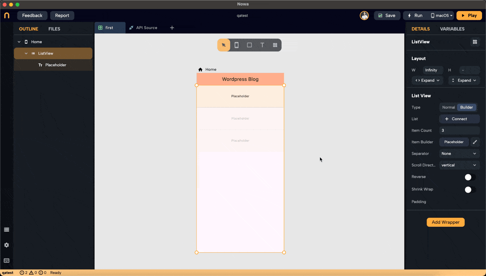
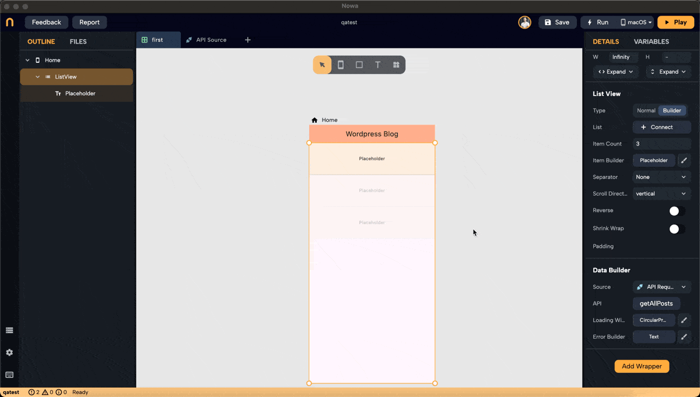
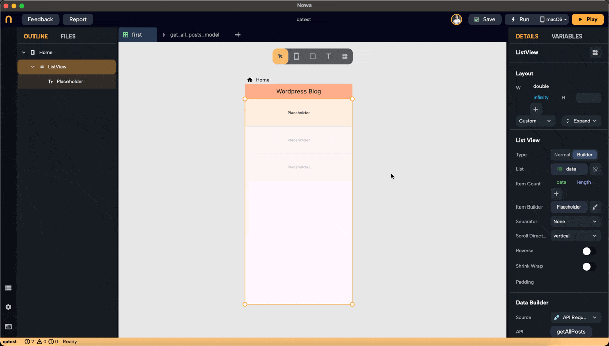

# Displaying API Response in the UI

In the previous sections, we covered how to:

- Create a collection and an API request.
- Generate a model from the API response by running a test.

Now, we'll move on to displaying the data retrieved from the API in your app's user interface (UI). In this example, we'll use the `getAllPosts` request to fetch all posts from a specific WordPress blog and display them in the UI.

## Steps to Display Data in the UI

To display the API data in your UI, we'll use the **Data Builder** wrapper in Nowa. This wrapper allows you to inject the results of an API request into your widgets seamlessly.

### 1. Add a Data Builder Wrapper

**What is a Data Builder?**

The Data Builder wrapper is a tool that:

- Injects the results of an API request into the UI.
- Provides access to a variable called `data` for all widgets nested under it.
- Automatically fires the API request when the screen loads.
- Displays a loading indicator until the data is received.

**How to Add It:**

1. **Navigate to the UI Editor:**

   - Open the screen where you want to display the data.

2. **Add the Target Widget:**

   - For this example, we'll display blog titles in a `ListView`.
   - Drag and drop a `ListView` widget onto your screen.

3. **Wrap with Data Builder:**

   - Select the `ListView` widget.
   - Click on **`Add Wrapper`** in the widget properties panel.
   - Choose **`Data Builder`** from the list of wrappers.
   - The `ListView` is now wrapped with a Data Builder, and widgets under it can access the `data` variable.

### 2. Configure the Data Builder

1. **Select the API Request:**

   - With the Data Builder selected, go to its properties panel.
   - Under **`Request Type`**, choose **`API Request`**.
   - Select the **`getAllPosts`** request from the list.

2. **Understand the `data` Variable:**

   - The `data` variable now contains the results of the `getAllPosts` request.
   - Its type is `List<GetAllPostsModel>`, which is the model we generated earlier.

   **Note:** If you didn't generate a model, the `data` variable would be of type `Response`, a generic JSON model. It's recommended to generate a specific model for easier data handling.

### 3. Bind Data to the ListView

1. **Connect the Data to the ListView:**

   - Select the `ListView` widget.
   - In the properties panel, find the **`List`** property.
   - Bind the **`List`** property to the `data` variable from the Data Builder.

2. **Set Up the Placeholder Widget:**

   - The `ListView` requires a placeholder widget to represent each item in the list.
   - For simplicity, we'll use a `Text` widget as the placeholder.
   - Add a `Text` widget inside the `ListView`.

### 4. Display Data in the Placeholder Widget

1. **Access Individual Elements:**

   - The `ListView` will iterate over the `data` list.
   - Each item in the list is accessible via the `element` variable.
   - The `element` variable is of type `GetAllPostsModel`, representing a single blog post.

2. **Bind Data to the Text Widget:**

   - Select the `Text` widget (the placeholder).
   - In the **`text`** property of the widget, bind it to `element.title.rendered`.

     **How to Do This:**

     - Click on the binding icon next to the **`Text`** property.
     - Choose **`element`** from the variables.
     - Navigate to **`title`** and then **`rendered`**.
     - This path corresponds to how the model is structured.

3. **Preview the Data:**

   - In the UI designer, you might see placeholder text like `[rendered]`.
   - This is due to the mock data generated when the model was created.
   - To see the actual data:

     - Click on **`Play`** to run the app in preview mode.
     - The `Data Builder` will fetch real data from the API.
     - The `ListView` will display the actual blog titles.

## Understanding the Process

- **Data Flow:**

  - **Data Builder Wrapper:** Fetches data from the API and provides it to child widgets via the `data` variable.
  - **ListView Widget:** Uses the `data` list to create multiple instances of the placeholder widget.
  - **Placeholder Widget:** Displays individual data items by accessing properties of the `element` variable.

- **Variable Types:**

  - **`data`:** A list of `GetAllPostsModel`.
  - **`element`:** A single `GetAllPostsModel` instance within the `data` list.

- **Model Structure:**

  - Each `GetAllPostsModel` contains:

    - A `Title` object with a `rendered` string.
    - A `Content` object with a `rendered` string.

## Tips and Best Practices

- **Generate Models for API Responses:**

  - Always generate a model for your API responses. This makes data binding easier and your code cleaner.
  - If you see the `data` variable as a `Response` object, go back and generate a model, then reselect the request in the Data Builder to update the `data` variable.

- **Use Mock Data for Design-Time Preview:**

  - Nowa generates mock data automatically when you create a model.
  - This allows you to see sample data in the UI designer without making actual API calls.
  - Mock data helps in designing and testing the UI effectively.

## Next Steps

In the next section, we'll delve deeper into working with **Mock Data**. We'll learn how to customize mock data and use it to enhance the design and testing phases of your app development.

**Proceed to the next section to learn more about using and customizing Mock Data in your app.**