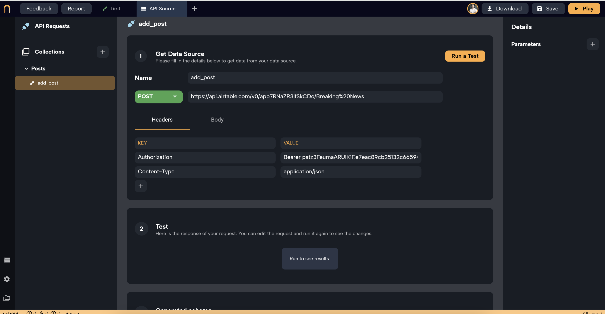
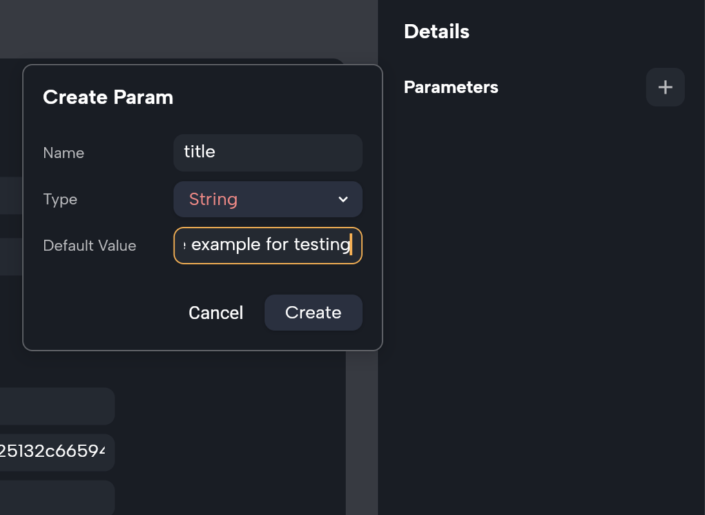
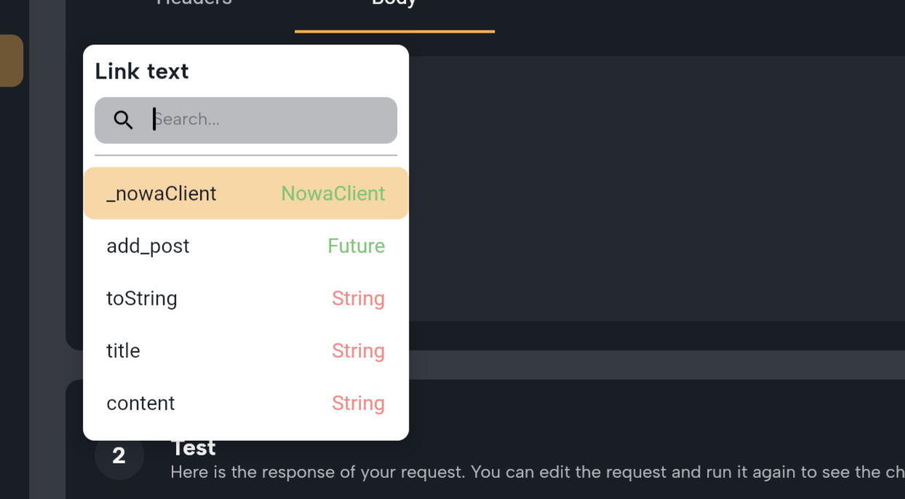
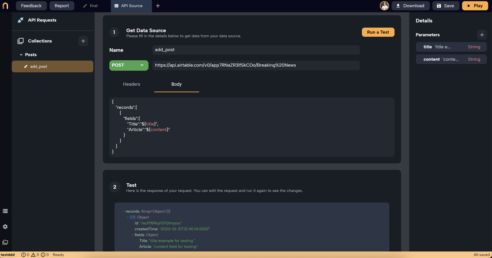
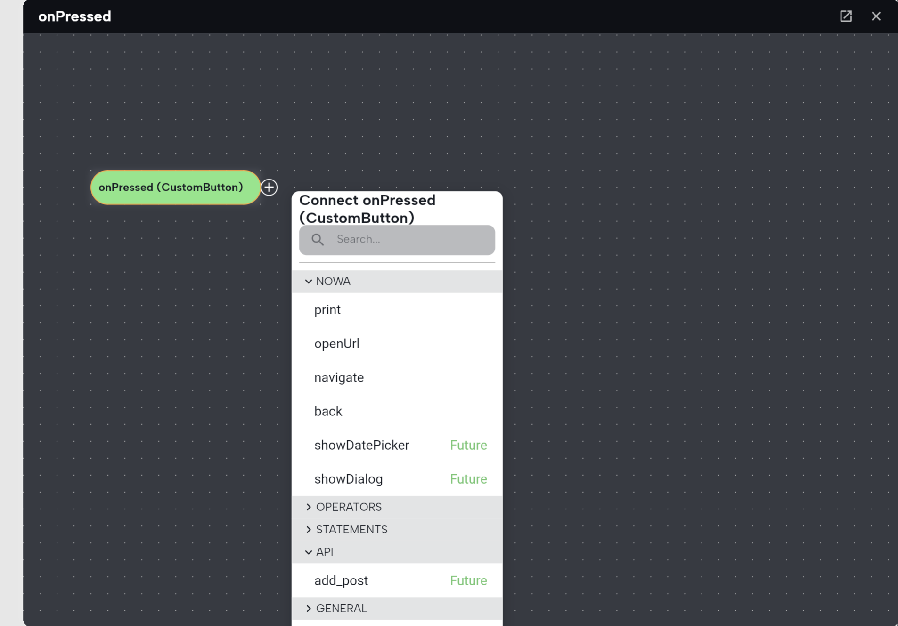

*In this page you will learn:*
```
1- how to add any request, including POST, to your app
2- how to test your request and fire it at a certain event   
```

Now you can seamlessly add POST requests and integrate them into your Nowa app. This guide will walk you through how to do so

## **How to Add a POST Request**

1. **Access Data Sources**:  
   Start by clicking on the `data sources` icon located at the bottom left of the software. From there, select the `API` option.

2. **Collection Management**:  
   - Click on "Add Collection". This feature allows you to organize your requests under specific collections. Conveniently, the requests in each collection will be generated into a single file with their data models.
   - Give your collection a name

3. **Creating the Request**:  
   - Click "Add request". Here, you'll need to name your request and specify its type. You can choose from various HTTP methods like GET, POST, PUT, DELETE, PATCH, and HEAD.
   - Paste the URL for the API endpoint where you wish to send the request.

4. **Adding Headers**:  
   - You have the option to specify headers for your request., such as Authentication, Simply click on the `+` button and then define them using key-value pairs.

   

5. **Defining Parameters**:  
   - On the right panel, you'll find the option to create parameters for this request. These parameters can be dynamically injected into the request body and can be sourced from various parts of your app, for example, a Text Field within a screen.
   - To add a parameter, click the `+` button. Define the name, type, and a default value for the parameter. This default value is what the system uses when no external data is passed to that parameter or when testing the request using the "Run a test" button.

   

   - To insert the parameters inside the request body, type a dollar sign `$`. A popup will appear allowing you to select the desired parameter. Alternatively, you can manually input it like `${Parameter Name}`. This syntax is similar to variable injection in the Dart programming language.

    
   
   :::danger
   Ensure that parameters inside the body are enclosed in quotation marks, e.g., `"Title": "${title}"`.
   :::

    


   - The "Run a test" function allows you to test your request, and it will also display a generated schema based on the received response.

6. **Utilizing the POST Request in App Logic**:
   - Navigate to the logic where you want to fire that POST request, for instance, if you want to fire it at a button click then navigate  to "on Pressed" logic for that button. 
   - Add a new node by clicking the plus button next to the existing node, or by right-clicking to open the node list. Proceed to the `API` section and select the POST request you've just created, in this example, it's name was "add_post".
   
  

   - Here, you can pass data to the POST request using the parameters you've defined. Input them manually by typing them inside the node, or connect them to any variable created for that screen. For instance, if there's a Text field in that screen, you will find "TextField Controller" node in the node list, From that node, you can fetch the text variable which holds what's written inside it by the user, and link it to one of the parameters of the POST request.

  

  - You can also add a logic to `on Value` which will be executed when the request is successful, you can for example show a popup there to the user, or simply update the UI by updating a variable then calling `Refresh` node


Now, you're all set to use POST requests in your app in Nowa. Happy building!