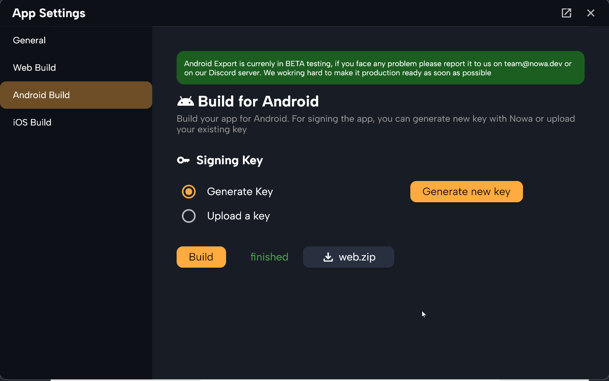
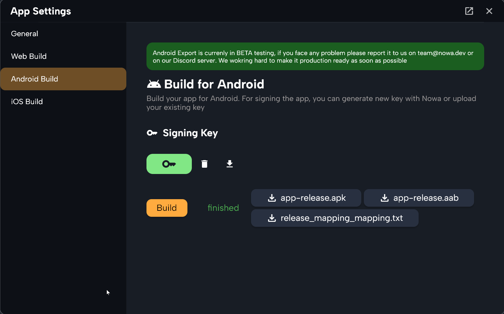

*In this guide you will learn:*

```
1. How to deploy your app to Android platform
2. How to sign your app with a new signing key, or by using your existing one
3. The difference between APK and AAB app formats 
```

After building your fantastic app with Nowa, it's time to bring your creation to the world of Android users. Let's walk you through how to publish your app on Android devices.

## Understanding the Signing Key

Before we start, it's important to understand the concept of a **signing key**. 

When publishing an Android app, you need to digitally sign your app with a private key. This key is unique to you and acts as a fingerprint, ensuring that future updates come from the original author and guarding against unauthorized modifications to your app. 

This is a crucial security measure in Android app development. You can either use an existing key or generate a new one with Nowa.


### Using an Existing Key

First of all, go to **Settings (by clickong on the Settings icon on bottom left) > Android build**. You will see two options for submitting the signing key, either by Generating a new one or upload an existing one. 

If you already have a signing key, choose **Upload existing key**.  Enter the **keystore password**, the **key alias**, and the **key password**, then select **Attach a key file** to upload your key file. The file should be in either `.jks` or `.keystore` format.

### Generating a New Key

If you don't have a key already, choose **Generate a key** then click on **Generate a new key**. Nowa will generate a new key with random keystore password, key alias, and key password. 

You can then download this key to use it to sign other apps as well. When you click on the download icon to download the signing key, a zip file will be downloaded, which contains the key file itself along with a text file containing the keystore password, key alias, and key password.

:::info
Remember, it's recommended to use a single key to sign all your apps. Always use the same key to release future updates. If you use a new key for an update, the Play Store will reject it.

Therefore if you didn't have a key before and you just generated one, then download it and use the same key for signing your other Android apps as well
:::




## Building Your App

Once you've selected or generated your key, you're ready to build your app! Click on **Build**. The process will go through various stages: preparing, fetching, and building.

The time it takes depends on server demand; on average, it's about 6 minutes but may be longer during peak times.

After the build completes, you'll see several files. Your app will be provided in two formats: APK and AAB. Click on any of the files to download it. 




## Choosing Between APK and AAB

Here's where you decide how to distribute your app. Both APK and AAB are file formats for Android apps, but they're used in different scenarios.

Use the **AAB format** if you're submitting your app to the Google Play Store. The Play Store requires this format as it allows Google to optimize the app delivery based on the user's device configuration.

Use the **APK format** if you're sending the file directly to a phone for installation, or if you're submitting the app to a store other than the Google Play Store.

## Updating Your App

So, you've released your app and users are loving it! Now you want to add new features, change the design, or fix bugs. Updating your app with Nowa is a breeze.

First, go to the **General** tab in the **Settings** page to update your build version and number. 

The version number is what users see as the version of your app , such as 1.0.0 for your first release. For the build number, it is not shown for users but it is used internally by the store itself to distinguish the older versions from the new ones.

You can't submit an app to the store with the same build number as an already uploaded version, so it's mandatory to increase the build number with each update, but changing the version number is optional. 

As a rule of thumb, you always increate the build number by 1 with each release, but for the build version, if you releasing a big update then you increase one of the big digits, like going from 1.5.1 to 2.0.0, but for minor updates you increase one of the small digits, like going from 1.5.1 to 1.5.2 or even not increase the version number at all but just the build number. 

After updating the build version and number, head back to the **Android Build** tab and click on **Build**. Ensure you're using the same key you used before. If you already generated or uploaded a key to Nowa before, it will be used to build the new version so you don't need to do anything about it.

**Congrats! now you know how to build your app to Android and even submit new updates to your users! Go out and make the world see what you have built 🔥 Happy app development!**


