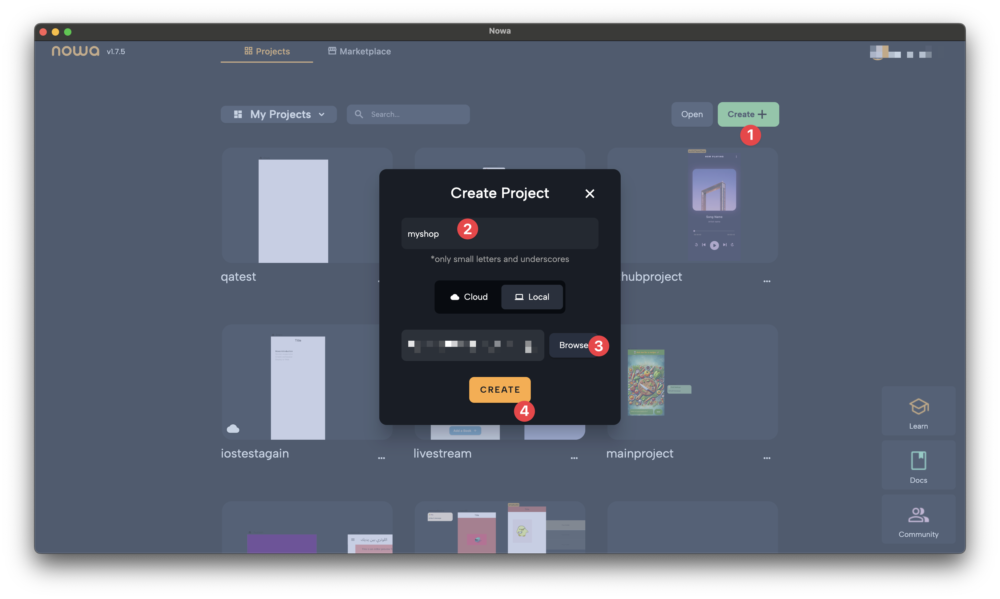
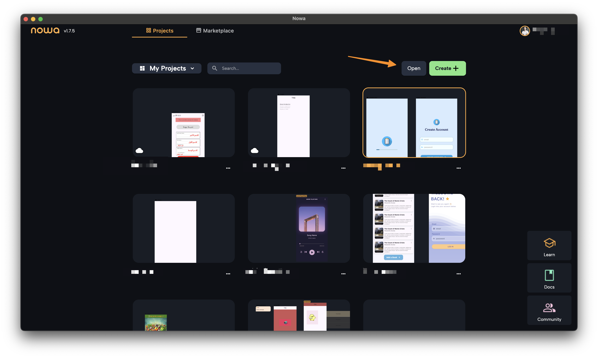

# Creating Local Projects in Nowa Desktop

With Nowa Desktop, you can create local projects in addition to cloud-based projects, offering you greater flexibility and control over your development process. This guide will walk you through the steps of creating a local project and highlight the benefits of working with local Flutter projects.

checkout this video to see how to use Nowa destkop full potential:

<iframe width="767" height="431" src="https://www.youtube.com/embed/Iounj9Z_Q1Y" title="The best setup for building apps : Nowa Desktop version + Hot reload on an Emulator / Real Device" frameborder="0" allow="accelerometer; autoplay; clipboard-write; encrypted-media; gyroscope; picture-in-picture; web-share" referrerpolicy="strict-origin-when-cross-origin" allowfullscreen></iframe>

## How to Create a Local Project

After installing the Nowa Desktop application, you can easily create local projects. Follow these steps:

1. **Access the Dashboard:** Open Nowa Desktop and navigate to the main dashboard.
2. **Initiate Project Creation:**
   - Click on the `Create` button within the main dashboard.
   - Choose the `Local` option when prompted.
3. **Set Project Details:**
   - Provide a name for your project.
   - Specify the path where you want the project to be saved on your device.
4. **Create the Project:**
   - Click on the `Create` button to finalize the process.
   - Nowa will create a local Flutter project at your specified location, complete with the necessary Flutter files and folders.

## How to open an existing project locally
To do so, on Nowa Desktop version, simply click on "Open" in the main dashboard where you can see all projects.

Then, choose the folder path and click on "Choose". The folder should be a normal Flutter project folder

### Converting Cloud projects to Local

You can convert cloud projects to local projects by:
1. Download the code for the local project. It will be downloaded as .zip folder
2. Extract the .zip folder
3. From Nowa destkop, click on "Open" as explained above and choose the folder that you just extracted

:::note
For now, you can convert a cloud project to a local one, but not the other way around.
:::

### Opening Existing Flutter projects
For now, it's recommended that when you open a local project that it was created within Nowa itself to avoid any problems in loading the project.

Since Nowa projects are Flutter project indeed, you can technically open existing Flutter project within Nowa. However, it might cause problems in case the project contains some code that Nowa can't analyze.

But, Nowa will be able to load any Flutter project including projects that was created outside Nowa starting from Nowa V2.0 (Coming in Nov/Dec 2024).  

## Cloud vs Local projects
The differences between local and cloud projects are as follows:
- With cloud projects you can use "Cloud run" to build your app online for Android, iOS or Web. For local ones, you will need to do the build manually using commands like 
  - `flutter build apk` For Android apk debug, `flutter build apk --release` for apk release, and `flutter build appbundle` for aab file.
  - `flutter build web` for Web.
  - `flutter build ios --release` for iOS.
- For local projects, beside using `Play` to preview the app, you can test the app on an [actual simulators / on real devices](./simulators.md). You can also use Hot restart to reload any change you do in Nowa to the simulator. For cloud projects, you can test the app by downloading the code first and then run it on a simulator or by building it already. For any change you do, you will need to download the code again to run it on a simulator or build again on the cloud

:::note

You can know if your project is a local or a cloud project by looking at the thumbnail. If it has the cloud sign then it's a cloud project, otherwise it's a local one

:::
   

## Benefits of Using Local Flutter Projects

Creating local Flutter projects in Nowa Desktop offers several advantages, particularly if you’re already familiar with Flutter development:

### 1. Maintain Your Original Workflow
- **Use Your Favorite Tools:** With a local Flutter project, you retain full access to your preferred development tools and workflows. This means you can continue using IDEs like VS Code, perform testing on simulators or real devices, and manage version control with Git.

- **Version Control:** You can easily [create a Git repository](../integrations/git/git_local.md) from the project folder, enabling you to maintain a local repository or push it to a remote repository on GitHub. This is particularly useful for collaborating with other developers or keeping your code backed up in the cloud.

### 2. Simultaneous Access in IDE and Nowa
- **Dual Access:** You can open your local project in your chosen IDE while simultaneously working on it in Nowa. This allows you to make direct modifications to the codebase in your IDE.
- **Reflecting Changes in Nowa:** If you modify the code directly within an IDE, those changes can be reflected in Nowa by reopening the project. This seamless integration ensures that you can work with both code and visual design without interruption.

Creating local projects in Nowa Desktop empowers you to leaverage the full power of building visually with Nowa, while maintaining your original development workflow.

Whether you’re a seasoned Flutter developer or just starting, Nowa Desktop provides a robust environment to build and manage your projects effectively.

    
