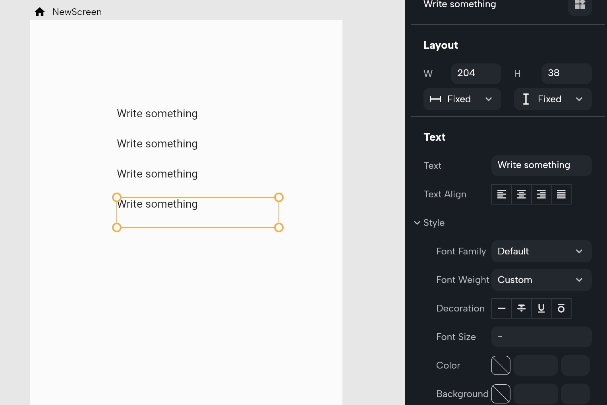

This section will guide you through the steps to display a list of book titles from a Supabase table on your Nowa screen.

## Displaying data from a Supabase table

Before starting this process make sure you connected your Nowa project to a Supabase project (check [Connect Supabase](./connect_supabase.md)).

**Step 1**: Add a text widget

1. Click the **Widget** button in the Nowa toolbar.
2. Scroll or search to find the **Text Widget** and click to add it to your screen.
3. Insert this widget inside a column (check how to it here: [Columns and Rows](../../ui/layout/rows_and_columns.md))

**Step 2**: Add Data Builder

The next step is to wrap the column containing the text widget with the **Data Builder** wrapper.

1. Select the column with the text widget.
2. Click on the **Add Wrapper** button in the details panel.
3. In the menu that appears, select **Data Builder**.

**Step 3**: Configure the Source

We need to configure the data builder to fetch data from Supabase.

1. From the details panel of the wrapper, under the **Source** property, select **Supabase**.
2. In the **Table** property that appears, select the table that you want to display from the drop down, in this case "books".

**Step 4**: Link the Children to the Data

Next, we need to link the children of the column to the data variable coming from the data builder.

1. Select the column.
2. Click on the **Children** property.
3. In the menu that opens, select the corresponding data variable from the data builder.

**Step 5**: Link the Text Property to the Data

The last step is to display the book titles from the data builder in the text widget.

1. From the outline, select the Text Widget that you added in step 1.
2. Click on the **Text** property in the widget's details panel.
3. In the menu select the data variable corresponding to the book title.

Congratulations! You've successfully set up your Nowa screen to display a list of book titles from your Supabase data source. Each time you open your screen, the data builder will fetch the most recent list of books from Supabase, ensuring that your data is always up to date.

