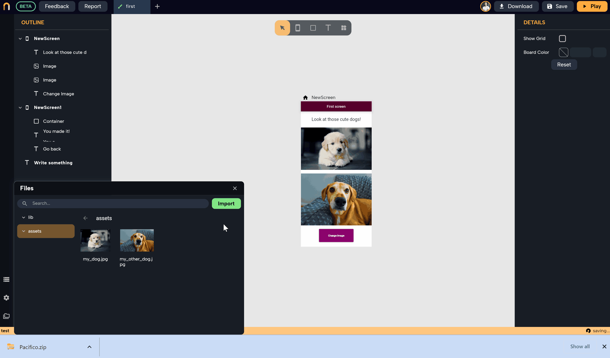

# Assets 

*On this page, you will learn:*
```
1.  Dealing with your project files using the Files panel
2.  Importing screens and components into the board
3.  Adding assets such as images and custom fonts
4.  permanently removing an asset from your project
```

  

To create a visually appealing app, colors, shapes, images, and fonts play a huge role in that. Let's walk through how to deal with your project files as well as adding assets to your app such as custom fonts and images.

  

## Assets Panel

  

The **Assets panel** is where you have access to all your project files and assets. To view your project files, click on the **Files** icon on the bottom left in Nowa. A popup will appear with two tabs: **lib (library)** and **assets**.

  


### Libraries (lib) section

  

The **lib** section is where your main project files are stored, such as screens, components, UI boards and objects. These are ultimately stored as Dart files. To use a screen or component, drag and drop it from the files popup to your project, you can also view the code for it by double-clicking on it.

You can create a new object, folder or a UI board by clicking on "Add".


### Assets Section

The **assets** section is where you can see all non-code files, such as fonts, images, and videos. To import a file, click on "import" or simply drag and drop the file directly into the project. It will automatically be added to the assets panel.

---


## Importing Images

You can import image files from your device in one of the following ways:

1.  Drag and drop the image file itself from your file browser into Nowa. An image widget with that image will automatically appear on the board.
2.  Import the image to the assets panel by clicking on "import" and then choosing the image file. Afterward, you can import it from the assets into the project by either:
	1. Drag and drop the image file from the assets popup into the project, an image widget with that image file will be automatically created 
	2. Dropping an image widget, and then connecting it with an image file by selecting that image widget, then choosing "Assets" as the source of the image in the details panel, then clicking on "Pick image" to choose the image file.

To use an online image, choose the **"Network"** option as the source of the image in the **details panel** of an Image widget, and paste the URL of the image in the URL field. 


:::caution

Ensure the link is to the image file itself (the link should end with an image format like .png, .jpeg, etc.).
:::

---

## Importing Fonts

To import fonts, either **drag and drop the font file (e.g., .ttf or .otf) directly into Nowa** or **click on "import" in your assets popup and choose the font file.**

After importing, go to the text widget you want to apply the new font to and **select the font from the "font-family" option inside the "Style section"** in the details panel for that Text widget. 

You can also **drop the font file itself from the assets pop up onto the board**, and it will create a Text widget with the font already selected.

 


---


## Removing and Renaming Files

To permanently remove a screen, component, or an asset file like an image or a custom font from the project, simply removing it from the board is not enough. You should **right-click on the file itself inside the files popup and click "remove."** You can also rename files by **right-clicking and selecting "rename."**


