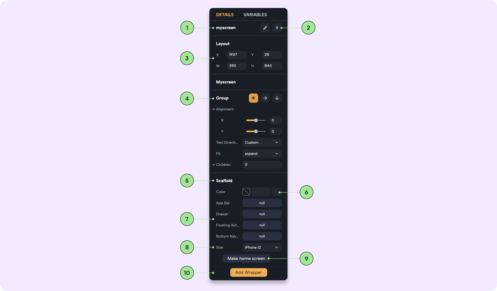

# Screen Properties

In this page we will explore the options, informations and properties that can be found on the details panel of a screen.

1. **Name**: in this section you can see the name of your screen and change it by clicking on the rename button.
2. **Open in circuit**: this button will open the circuit logic of the selected screen.
3. **Layout**: here position and sized of the screen can be changed.
4. **Group**: screen are by default set to be a stack, in this section you can change the layout of the widgets inside the screen by selecting a column or a row. Learn more about [Layout](../layout/intro-layout.md).
5. **Scaffold**: the scaffold is the wrapper that makes the stack a screen. If removing this wrapper the screen selected will not be a screen anymore.
6. **Screen color**: this color picker changes the background color of the screen selected.
7. **Navigation**: in this section you can add navigation widgets like: appbar, floating action, drawer, bottom navigation. 
8. **Size**: from here you can change the screen size and pick from a default one.
9. **Make home screen button**: when pressing the button the selected screen will become the home screen, which means that it will be the first screen appearing when paying the app.
10. **Wrappers**: this button lets you add wrappers to the selected screen. Learn more about [Wrappers](../wrappers/wrappers-intro.md).
