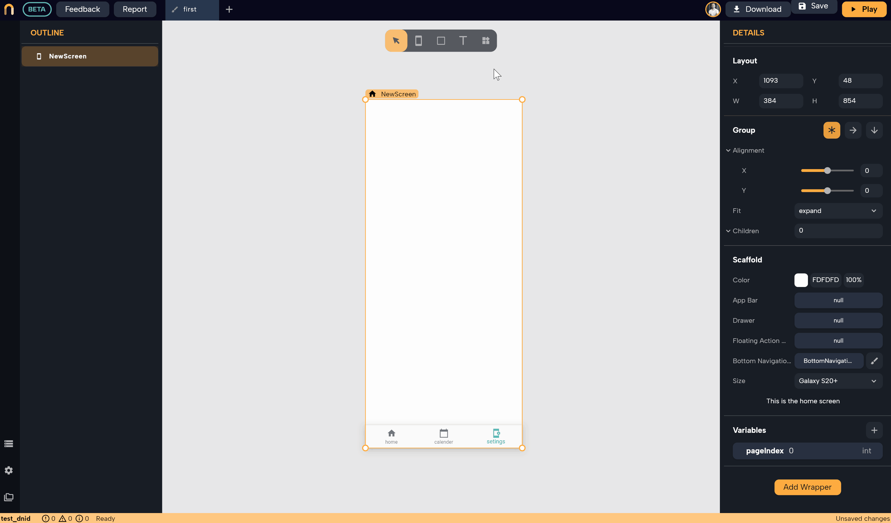

*On this page, you will learn:*
```
1. Accessing screen properties
2. Adding and modifying screen-level widgets
3. Defining the layout for the entire screen
4. Making a screen the home screen of the app
5. Adding variables to the screen level
```


After adding your first screen, you will want to do some setup for the screen before jumping on designing, doing so will make your design process much more efficient. Let's see what screen details you can play around with (here's a hint: eveything 😉).


## Accessing Screen Properties

After adding a screen, you should familiarize yourself with the special properties available for screen customization. To access these properties, simply **select the screen** and the **details panel** on the right will display them.


## Screen Name and Circuit Logics

At the top of the details panel, you can **change the screen name**, as well as view **all the logic** that is implemented in that screen using **Circuit**. For more information, check out the [Introduction to Circuit](../../circuit/circuit_intro.md).

## Layout Settings

In the layout section, you will find the **X and Y positions** of the screen on the board and the **width and height** of the screen. By default, the width and height will be set according to the screen device you choose when creating a screen, but you can modify them as needed.

## Group and Main Layout Structure

The **Group** section that comes next displays the main layout structure of the screen. There are three options:

1.  **Stack** (default option, identified by the star logo) - Widgets inside the screen have their free positions, with specific X and Y coordinates. You can drag and drop them to the desired location.
2.  **Row** (➡️) - Widgets are ordered next to each other.
3.  **Column** (⬇️) - Widgets are ordered above one another.

For more details, check out [Groups](../layout/groups.md).

## Scaffold Settings

The **Scaffold** section, visible only when selecting a screen, allows you to control screen-level details and widgets, such as:

-   Changing screen background color
-   Adding widgets such as AppBar, floating Action, bottomNavigationBar, and more

### Adding and Modifying Widgets

To add screen-level widgets, either **drag and drop them** from the widgets panel like any other widget (they will automatically be placed in the correct location) or **click on "null"** in the Scaffold section in the details panel beside the widget you want to assign, and then choose the widget from the popup that shows.

After adding a widget, click on the **brush icon** next to the widget in the Scaffold section to modify its properties.

To remove a widget, right-click on the widget name next to the brush and choose "reset to default."

The brush icon will also take you to the inner widget properties. For example, when clicking on the brush next to the AppBar widget, you can access AppBar details, where you can change the AppBar background color, add a leading widget, and more.

:::tip
the brush icon lets you zoom in on that widget and modify its details. For any child widget, you will see this brush next to it in the details panel. Another option to access those child widgets is just by double-clicking on them on the board 
:::

#### Adding AppBar example

In the following example, we added an **AppBar** widget from the widget panel, then we could access it by double-clicking on the widget itself, or by selecting the screen and then scrolling down to **Scaffold** section in the **details panel** and clicking on the **brush icon** next to the AppBar.

Afterward, we did change the icon of the 3rd option in the BottomNavBar widget by opening its properties by clicking on the brush icon next to the widget name in **scaffold** section, and then opening the icon widget details by also clicking on the brush, and then choose another icon.   




## Setting up a Home screen

Set a screen as the **home screen** in the Scaffold section to make it the main screen when the user opens the app. When pressing play, the app will start from that screen as well.

## Variables Section

In the **Variables** section of the details panel, which is the last section, you can view and add variables to the screen. These variables can be accessed by any widget or component inside the screen. For more info, check out [Creating variables](../../variables/create_variables.md)

