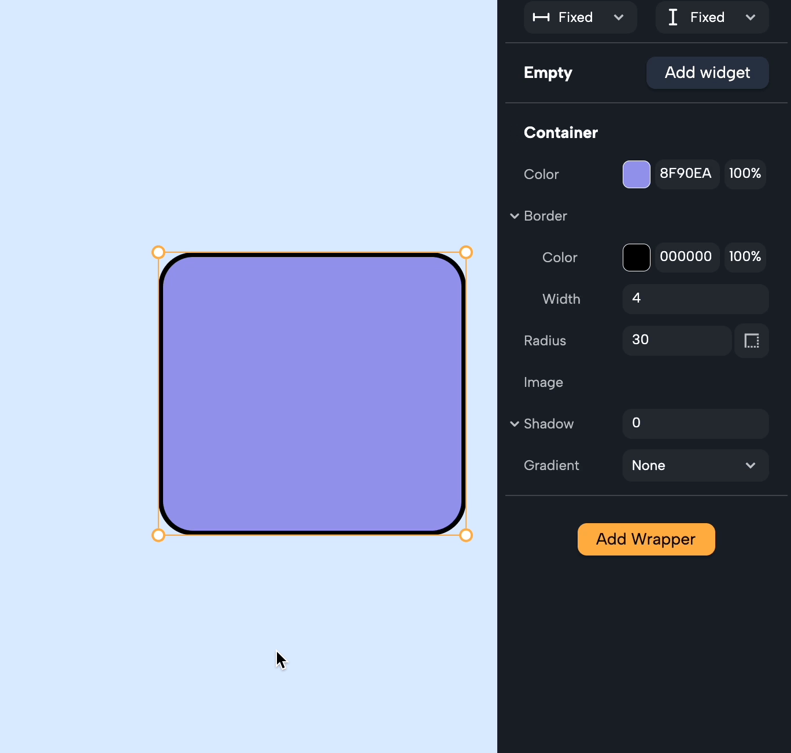
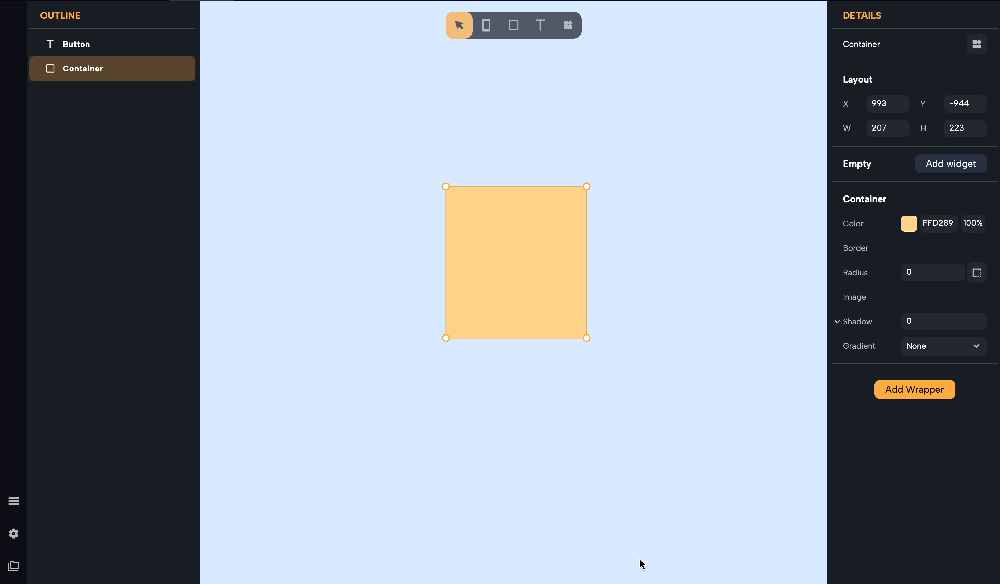

*In this page you will learn:* 
```
- How to add a Container widget to your screen.
- Modifying the appearance of your container (color, border, radius).
- Filling your container with images and adjusting their fit.
- Using additional properties like shadows and gradients.
- Adding widgets inside the container.
- Using the Container as a wrapper for enhanced visual effects.

```
## Container Properties

In Nowa, the **Container** is a flexible widget that enables many design options.
You can add Containers to your screens by selecting the "Shape" tool in the tool bar, or from the Widget Picker.


After drawing a Container, you can modify it's properties to change its look. Let's have a look at the options that can be modified:

- **Color**: By clicking on the small square with the color preview, you can select a color using the color wheel that you want to be the fill of your container. You can change the opacity of the color too.

- **Border**: By clicking on the "+" icon next to the Border property, a border around the container will appear. You can change the color and the width of the border.

- **Radius**: You can make the corners of your container rounded by modifying the number in the Radius property. By clicking of the icon next to it, you can also modify the Radius of the corners individually.


#### Fill with images
But it's not over! You can also fill the Container with an Image.
To achieve this, select the container and click on the "+" icon next to the Image property.

You can fill the container with **images from the web**. To do it copy and paste the URL of an image in the URL property and press enter.
You can also fill the container with **images from your assets**: select the assets tab in the details panel and pick an image from your existing assets or upload a new one from your local files.

You can change the fit of the image inside the container. You can pick between the following options:

1. **Fill**: The image will fill the container, changing the aspect ratio of the image. This means the image might be stretched either vertically or horizontally, depending on the size of the container.
2. **Contain**: The image will scale itself to fit inside the container while maintaining its original aspect ratio. This means the entire image will be visible within the container, but there might be some empty space in the container either at the sides or at the top and bottom.
3. **Cover**: The image will scale itself to cover the entire container while maintaining its original aspect ratio. This means the image might overflow the container either vertically or horizontally. Parts of the image might not be visible.
4. **FitWidth**: The width of the image will scale to match the width of the container, but the height of the image might not match the height of the container. The aspect ratio of the image is preserved.
5. **FitHeight**: The height of the image will scale to match the height of the container, but the width of the image might not match the width of the container. The aspect ratio of the image is preserved.
6. **None**: The image won't be resized at all. It'll be rendered in its original size. If the container is smaller than the image, parts of the image will overflow the container.
7. **ScaleDown**: This option will make the image scale down to fit inside the container while maintaining its original aspect ratio, but only if the image is larger than the container. If the image is smaller than the container, it remains its original size.




#### More properties

The **Container** had more properties to offer:

- You can add a **Shadow** to the container to create dept in your designs
- Other than Color and Images, you can fill your container with a **Gradient**.

## Add Widgets to Container

The Container is so much more than just a shape: it can be used also to contain other widgets to create different effects. 

When you select a Container you will see the button "Add Widget" at the top of its properties. From here, you can add other widgets as children of the container. 
This feature is useful, for example, for adding a background to icons.

💡 After adding a widget as a child, you can keep modifying the Container as you wish.




## Container as a Wrapper

The Container can also be added as a wrapper to any widget. 
To do it, select the widget you wish to add a container to (it could also be another container), select the "Add Wrapper" button and Select "Container".

This feature is useful for example to create visual effects like adding a gradient or a color on the top of an image.

💡 Multiple Container Wrappers can be stuck on the top on each other and can be rearranged to achieve the desired effect.


