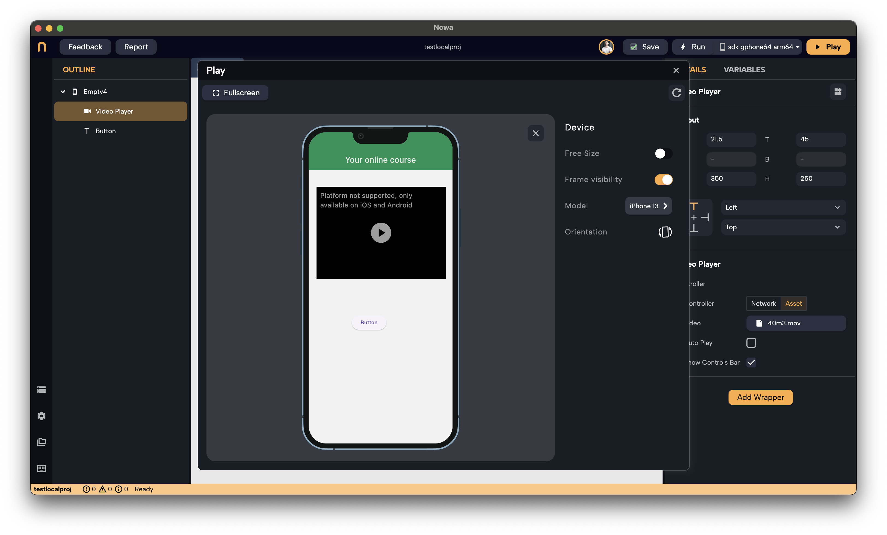

# Video Player 

In case you building an app for online courses or education, then displaying videos inside the app is very important. Let's see to do that using the `Video Player` widget.

## Adding the Video Player Widget

1. To integrate a video player into your app, start by opening the widget panel. You can do this by either navigating through the user interface or by pressing `Ctrl`+`P` (`Cmd`+`P` on macOS).
2. Scroll through the available widgets or search for `Video Player`.
3. Drag the `Video Player` widget onto your desired location on the screen within the app layout.

## Configuring the Video Player widget

Once you've placed the Video Player widget on the screen, select it to access its customization options. You'll find the following settings in the details panel on the right:

### Source Selection

- **Asset**: Use this option if you prefer to display a video already uploaded to your app. To choose a video, click "Pick a video," which will open your asset panel displaying any previously uploaded video files. If you haven't uploaded a video yet, click "Upload" at the top right. 

:::caution
Embedding videos directly into your app can significantly increase its size, which may lead to issues for some users. We generally recommend using the Network option instead.
:::

- **Network**: Select this for videos hosted online. You'll see a field labeled "Url" - paste the direct link to the video file here. Ensure the URL points directly to a video file (e.g., ends with .mp4 like `http://.../filename.mp4`).

### Playback Options

- **Auto play**: Check this if you want the video to start playing automatically when the screen loads.

- **Show controls bar**: Enable this to display the video control bar (includes play, pause, etc.). Consider disabling this if auto-play is enabled and you wish for the video to play without user intervention. However, note that disabling both auto play and the control bar will result in a video that cannot play or be controlled upon screen loading.

This is how the controller will look like (played on iOS emulator)

:::note

- The Video Player widget cannot be previewed using the built-in previewer.
- To properly test the Video Player functionality, use an Android or iOS emulator, or test directly on your smartphone. This feature is exclusive to the Desktop version of Nowa.

For more detailed instructions on testing your app on Android/iOS emulators or actual device, refer to [this Youtube tutorial on using Nowa on Desktop](https://www.youtube.com/watch?v=Iounj9Z_Q1Y&t=9s&pp=ygUMbm93YSBkZXNrdG9w).

:::

Having video content displayed inside your app can add a huge value for your users, but always remeber the importance of keeping it simple and intutive for your users to use your app. 

Let's go build something great 🔥 
