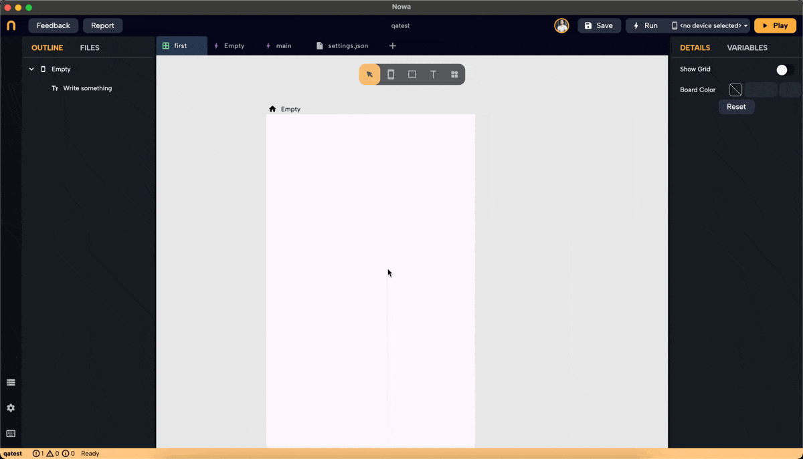

## Linear Progress Indicator

The Linear Progress Indicator widget allows you to visually represent the progress of a task or operation in a linear bar format. Below are the steps and customization options for using the Linear Progress Indicator in Nowa.

### Steps to Add a Linear Progress Indicator

1. **Add the Widget**:
   - Navigate to the widget panel and select the Linear Progress Indicator.

2. **Position and Size**:
   - Adjust the position by dragging it, or by adjusting the values for Left (L), Top (T), Right (R), and Bottom (B).
   - Set the Width (W) and Height (H) by dragging the sides, or by entering values for it in the details panel.

3. **Alignment**:
   - Use the alignment tool to set the alignment of the Linear Progress Indicator. Options include Left, Center, Right, Top, and Bottom.

   

### Customization Options

   

1. **Value**:
   - Set the progress value, ranging from 0.0 to 1.0, where 0.0 represents no progress and 1.0 represents full progress.

2. **Background Color**:
   - Choose a background color for the progress bar using the color picker or by entering a hex color code.

3. **Color**:
   - Set the color of the progress indicator itself using the color picker or by entering a hex color code.

4. **Minimum Height**:
   - Specify the minimum height of the progress bar to control its thickness.

5. **Semantics**:
   - **Semantics Label**: Provide a label for accessibility purposes to describe the progress indicator.
   - **Semantics Value**: Set a value for accessibility purposes to convey the progress level.

6. **Radius**:
   - Set the border radius to control the roundness of the corners of the progress bar.

### Example Configuration

- **Value**: 0.4 (Represents 40% progress)
- **Background Color**: Choose a color that complements your app's theme.
- **Color**: Select a color that stands out against the background color.
- **Minimum Height**: Adjust according to the desired thickness of the progress bar.
- **Radius**: Set a value to achieve the desired roundness of the corners.

### Final Notes

Adjust the parameters to fit the design and functionality requirements of your application. The Linear Progress Indicator is a versatile widget that can be extensively customized to match your app's theme and provide effective visual feedback to users.
