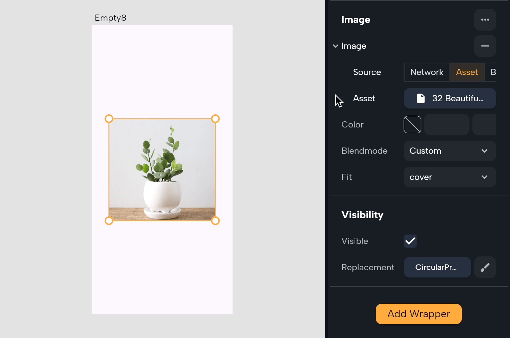

The **Visibility wrapper** is a powerful and versatile tool that allows developers to control the visibility of a widget in their application. This wrapper provides a straightforward way to show or hide widgets based on certain conditions, enhancing the dynamic nature of your app's UI.

Use the Visibility wrapper when you need to conditionally display or hide widgets in your Flutter application. It is particularly useful for:

- Toggling UI elements based on user interactions or state changes.
- Managing layout complexity by showing only relevant parts of the interface.
- Optimizing performance by removing off-screen widgets from the widget tree.

### Properties:

**Visible**: Determines if the wrapped widget should be displayed. When set to `true`, the widget is rendered and visible to the user. If set to `false`, the widget is removed from the layout, effectively hiding it from view.

**Replacement**: allows you to specify an alternative widget to display when the `visible` property is set to `false`. You can customize this property to show a placeholder, a loading indicator, or any other widget you prefer.

