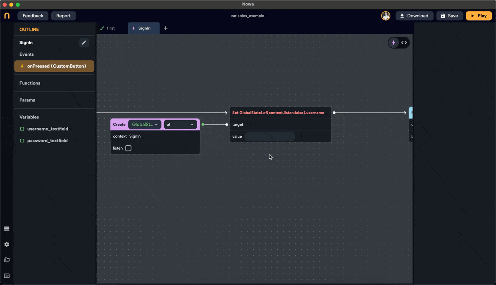

After setting up global variables within your Nowa app, leveraging these variables to enhance your app's interactivity and logic is important.

This guide will detail how to connect global variables to your app's UI and modify their values using the Circuit editor, making your app dynamically respond to user inputs and internal logic.

## Using Global Variables with UI

Global variables, like local ones, can be connected to UI elements or used purely within your app's logic. For example, a global variable can indicate whether a user is authenticated without directly impacting the UI. However, it's often useful to link these variables to UI components to reflect changes across your app.

### Connecting a Global Variable to UI

1. **Select a UI Property**: Identify the widget property you wish to connect to a global variable, such as the `text` property inside a Text widget which is intended to display the username.
2. **Access Global Variables**: Click on the chosen property in the details panel, then navigate to the "Global" tab to open it.
3. **Select Your Global State and Variable**: Choose the global state containing your variable, then select the variable you want to connect, like `username` from "GlobalState1" in the following example.

Example: Displaying the Username

Imagine you want to greet the user by name on the main screen. You would connect the `username` global variable to a Text widget, which, combined with another Text widget containing "Hello", dynamically creates a personalized greeting.

This connection means the Text widget will now display the value of the global `username` variable, dynamically updating as the variable's value changes.

## Setting Global Variable Values in Circuit

To make your app respond dynamically, you might need to update global variable values based on user actions, like signing in.

### Example: Updating `username` on Sign-in

1. **Prepare Your UI**: Assume you have a TextField for username input inside the login page, and this Textfiled has a controller property that is linked to a local variable `username_textfield`. (this controller is varibale allowing reading from or changing the text field value)
2. **Use Circuit for Logic**: On the sign-in button's "On Tap" event, open Circuit to add logic.
3. **Access Global State**: Add the global state object that containins `username` to your Circuit logic.
4. **Set New Value**: Click on + next to the global state object, then choose `username` then choose "Set username" to add the node responsible for updating the `username` value (which will be based on the TextField input).
5. To do that connection between setting the new value of the `username` and getting the text from the username TextField, you can either:
   - **Direct Input**: You can type a new value directly into the "Set username" node using the dollar sign expression (explained in the end)
   - **From TextField**: Connect the `username_textfield`'s `text` output to the "Set username" node, dynamically updating the `username` global variable with the user's input, as shown in the following video:
6. Finalizing User Sign-in: After setting the `username` variable, add a "Navigate" node to move the user to the home screen, where the "Hello, [username]" message awaits, reflecting the newly updated `username` value.

## Advanced Circuit Techniques

- **Code Expressions**: Use code expressions within Circuit to inject variable values directly into text fields or other properties, enhancing the flexibility of your app's logic and UI responses.

## Summary

By connecting global variables to UI components and adeptly manipulating these variables within Circuit, you can create a seamless and dynamic user experience in Nowa. Whether it's personalizing greetings, managing user sessions, or adapting UI elements to reflect app states, global variables offer a robust toolset for developing responsive and interactive apps.

