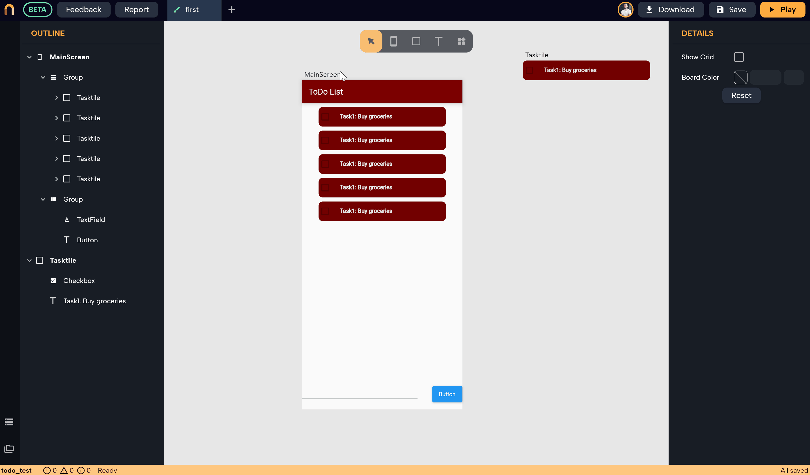
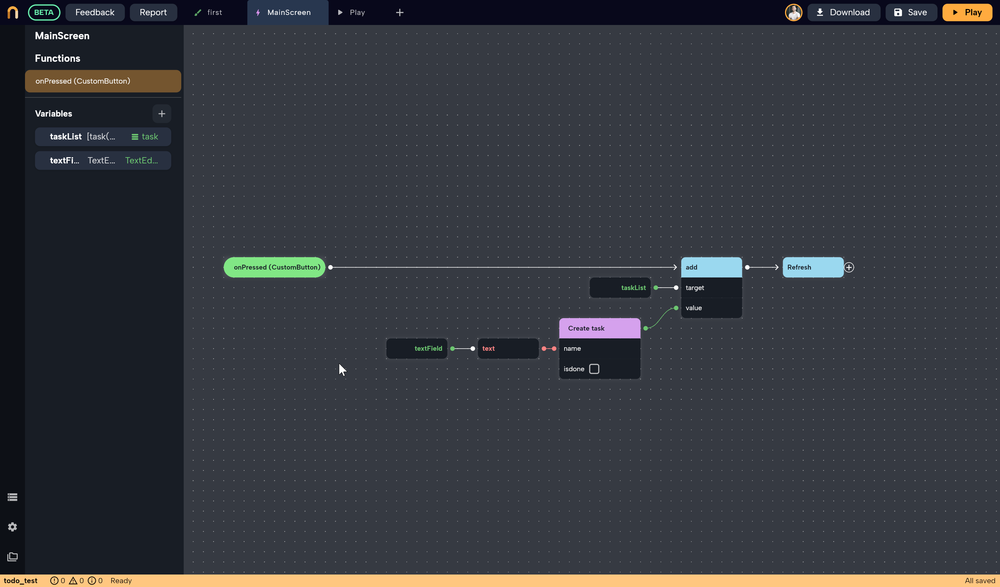
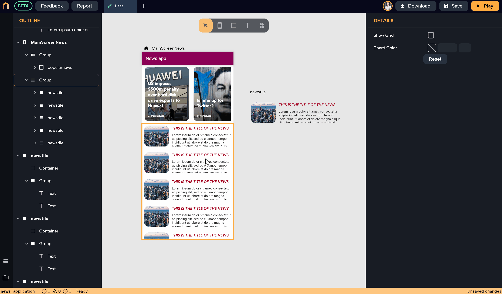

*In this section, you will learn:*

```
1. Create lists of standard and custom types
2. Filling the list manually, with Circuit or with a data-source
3. Display the list in a Listview and Gridview 
```


If you building a professional app, there's 95% chance at least that you will need to have a list that displays a group of data in a pleasant way. This guide will walk you though **creating a list, filling it and then displaying it to your users**.

## Create a list

To create a list of a certain type, **choose the "List" option when selecting the data type** of the variable in the popup of creating a variable.


### Lists of custom objects 

You can create variables that are lists of custom objects you created before.

In the following example, we are creating a list called **tasks** that presents a list of a custom object called **task** that was created before. This object presents a single task and holds its name of it and a boolean whether the task is completed or not yet.  the (check [Objects](./create_objects.md) for more information). This list will hold a list of all tasks we have and we will display them in a group for the user. Check [Groups](../ui/layout/groups.md) for more information  




---

## Filling Lists

There are three ways to fill a list with data:

#### 1. Filling a List Manually

To manually fill a list:

1.  Open the variable editing popup by **selecting the screen/component and clicking on the variable** in the variables section in the details panel.
2.  **Click on the + icon next to the default value field** to add an item to the list. You can modify this item as needed.
3.  If you include a number in the default value field, it will **create that number of default items in the list**. You can then change their value in the fields for each item underneath the default value field.


#### 2. Filling a List Using Circuit

To fill a list using Circuit:

1.  **Use the "add" node associated with the list variable**. Drop the list variable from the **Local** section in the circuit, then click on + next to it to view the list of node options that can be connected to the list. Select the "add" node.
2.  After selecting the **Add** node, the list variable will automatically connect to the list using the pin **target**. The other available pin is **value** where you connect the item you want to add to the list.

#### Example: To-Do App logic
This logic for a to-do app of adding a task object to the list when clicking a button to add a task. The text is taken from the **Textfield widget**, added to a new object of type **task**, and then this object is added to the list **taskList.** The **refresh node** is called in the end to update the UI.




#### 3. Filling a List from a Data Source

If you have a Data source added to your app, you can use it with **Data builder widget** to pass the data to the UI. For example, check out [GET request](../data/get_request.md) to see how to create an API get request and have the list of data injected into your screen.

---


## Displaying Lists 
There's many ways to display lists in Nowa. The optimal way is to use Listview and Gridview widgets. 

The other way is using the `Group` widget to add a `row` or `column`

### using Listview or Gridview
The optimal way to display a variable or parameter list in Nowa is usin Listview or Gridview widget in a "Builder" mode.

Check out how to [use Listview](../ui/widgets/widget_desc/listview.md) and [Gridview](../ui/widgets/widget_desc/gridview.md)


### Using groups

:::warning
This way is not recommended. Use it only if you have a reason for not using Listview or Gridview widget
:::

To display a variable list in your UI, follow these steps:

1.  **Use a Group widget with a row or column layout**. Have at least one child inside of it as a placeholder. The children inside the group will act only as a preview of how the UI will look when the group has that amount of children inside. Check out [Groups] for more information on creating groups.
2.  **Select the group and connect its property *Children* with a list variable in the details panel.** The children widgets will be replaced with a single widget that acts as a placeholder, which will be the first child that was in the group before connecting it to a variable list. You can change that placeholder by selecting the group and then clicking on the arrow next to the **children** field in the details panel to expand it, and then you will see the placeholder widget. Click on it to choose another placeholder, or click on the brush next to it to open that placeholder widget for any widget edit.
3.  **Select the placeholder widget inside the group and connect its properties to the variables inside the single object *element* that each placeholder instance will receive from the group**. For example, if your placeholder widget was a **Text** and you want to display a text coming from the list, connect the property **text** of the widget to a string item that is inside the **element** object itself. This will make each Text placeholder display different text for each item in the list.

### Example: Displaying the Latest News with Nowa

In this example, we will explain how to create an app that displays the latest news using a row group, a custom component, and an API to fetch news data.

#### Overview

We have an app that displays the latest news using a row group with children consisting of instances of a component called **newstile**. This component was created to display a single news tile and contains three widgets: an image, a title text widget, and a content text widget.

We receive our data from an API, and using the Data Builder widget, we can access the list of news loaded in the UI. The list, called **records**, holds all the news items. Each item in the list is an object called **fields** that represents a piece of news, containing three String variables: `imageURL`, `title`, and `content`.

#### Connecting Data to the Placeholder Component

Our goal is to connect these variables to their corresponding fields in the placeholder component inside the row to display the news from the API. Follow these steps:

1.  Connect the list **records** that exists inside an object called _gtnews2Obj_ (automatically created by the GET API request to wrap the list; see [HTTP GET]  for more information) with the **children** property of the row. The row was created previously by simply grouping multiple copies of the component **newstile** (see [Components](../ui/components.md) and [Groups](../ui/layout/groups.md) for more information).
    
2.  After connecting the list, the children of the row will be replaced with a single placeholder, which is also an instance of the **newstile** component. At this point, if we run the app, the row will create an instance from the placeholder for each news item it receives and pass the **element** object that holds the data for that particular news item to the instance.
    
3.  The next step is to connect the data inside the **element** object to the variables of the instance to display the image, title, and content. To do so, select the placeholder and connect the image variable for the instance with the `imageURL` field inside the **fields** object that is inside **element**. Repeat this process for the title and content variables.
    

When you press play, the app will load the news and display all the news items inside the row. Each news item will be displayed inside an instance of the placeholder, which comes from the component **newstile**.




:::tip
Don't forget to wrap the Group with **Scroll View** to make it scrollable
:::

:::caution
When connecting a variable that is a number or double to a text property of a text widget, make sure to use `toString` to convert the number to a String. This will ensure that the value is displayed correctly within the text widget.
:::