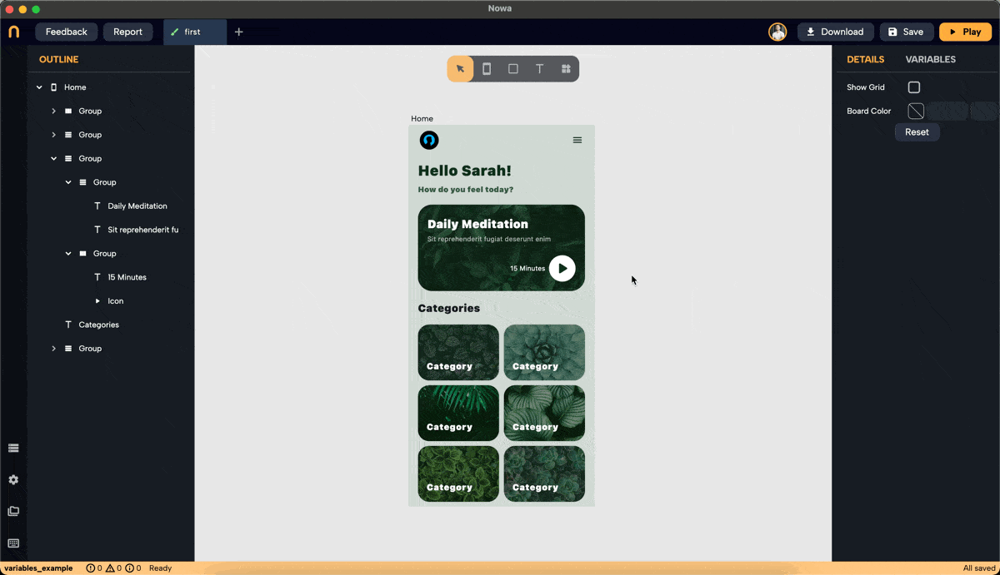

After understanding how to create variables in Nowa, let's explore how to effectively utilize them to make your apps interactive and dynamic. Continuing with the example of a meditation app that plays sounds for relaxation, we'll delve into connecting a variable to a UI property and changing its value to update the UI dynamically.

## Connecting a Variable to UI

In our meditation app example, we have already created a variable named `icon`. Now, we aim to connect this `icon` variable to the `icon` property of an Icon widget to make our UI interactive.

### Steps to Connect a Variable to UI Property:

1. **Select the UI Property**: Click on the `icon` property of the Icon widget. A popup will appear listing all available variables.
2. **Choose the Variable**: Open the "Local" section to display variables and parameters created within that screen. Select the `icon` variable.

**Ensure Type Compatibility**: The variable type must match the property's expected type. In this case, our `icon` variable is of type `IconData`, which is compatible with the Icon widget’s `icon` property.

:::tip

You can know the type required from each property by hovering over it with the mouse

:::

:::tip
### Quick Variable Creation and Connection:

- **Fast Track Method**: Click directly on the UI property you wish to connect a variable to and select "Create variable". This action creates a variable matching the property's required type and connects it automatically. The variable will have a default name (like "var1"), which you can rename in the variables section.

:::
## Updating UI Dynamically

The purpose of connecting a variable to a UI widget property is to allow dynamic updates to the UI based on changes to the variable's value. This interaction is key to creating a responsive and engaging user interface.

### Changing the Variable Value:

In our app, we want the play icon to change to a pause icon when the user taps it. Here’s how to achieve this:

1. **Add Interaction**: Wrap the Icon widget with a `GestureDetector` to detect taps.
2. **Set Up Logic for Tapping**: In the "On Tap" logic, use the Circuit editor to add a node for changing the variable's value.
    - Add a node by clicking "+" in the event of tapping.
    - Navigate to the "Locals" category and select our `icon` variable, then choose "Set" to change its value.
    - When setting the new value, an icon picker appears. Choose the pause icon.
    - Connect a "Refresh" node to update the screen and reflect the new icon value.
3. When you run the app and tap on the icon, you'll notice the icon dynamically changes from play to pause. This demonstrates how variables connected to UI properties can significantly enhance interactivity and responsiveness in your Nowa apps.

## Conclusion

By connecting variables to UI properties and adeptly changing their values, you can create highly interactive and dynamic interfaces in your Nowa apps.

