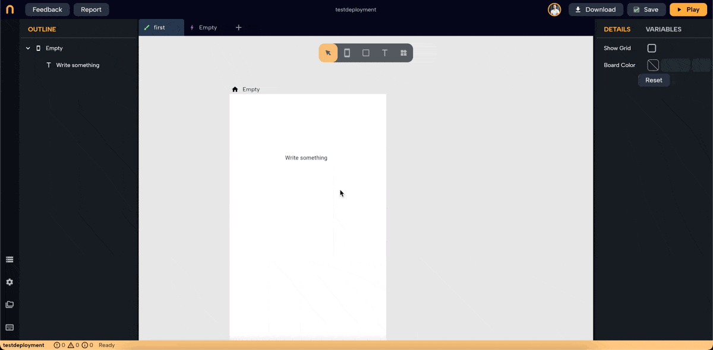

Let's see how you can override and add your logic to exisiting flutter state functions, such as `initState` and `dispose`.

## Overriding Functions

To enhance your app's functionality with custom initialization and cleanup logic, Circuit allows for the overriding of `initState` and `dispose` functions. This can be done by:

1. Navigating to the screen or component's Circuit editor.
2. Clicking the plus icon next to "Functions" and choosing to either create a new function or override an existing one, like `initState` or `dispose`.

## Importance of "Call Super" Node

Upon overriding, a "Call super" node appears, representing the crucial call to the parent class's method (`super.initState();` or `super.dispose();`). Including this ensures the inherited functionality is executed, maintaining the integrity of the widget's lifecycle.

## Custom Logic Integration

After the "Call super" node, you're free to connect your custom logic. This enables executing specific tasks immediately after the parent class's logic, providing a seamless integration of custom functionality into the widget's lifecycle.

## Use Cases for Overrides

### `initState` Overrides
- **Checking if the User is Already Signed In**: Right when the screen loads, you can check if a user is already signed in to decide what to show them next.
- **Fetching Data**: Ideal for initializing screens with external data.
- **Setting Up Listeners**: For starting event listeners or streams.
- **Initializing Controllers**: Perfect for setting up any controllers for your widget.

### `dispose` Overrides

- **Cleaning Up Resources**: Ensures all resources like listeners or controllers are properly disposed of.
- **Canceling Network Requests**: Useful for stopping any ongoing data fetch operations.

## Extending Overrides

To override other state functions, simply create a new function with the name of the desired state function you aim to override. This allows for extended customization and control over your widget's lifecycle events.

---

Leveraging these overrides in Circuit not only empowers your app with efficient resource management but also ensures a smooth user experience by optimizing widget performance from initialization to disposal.
