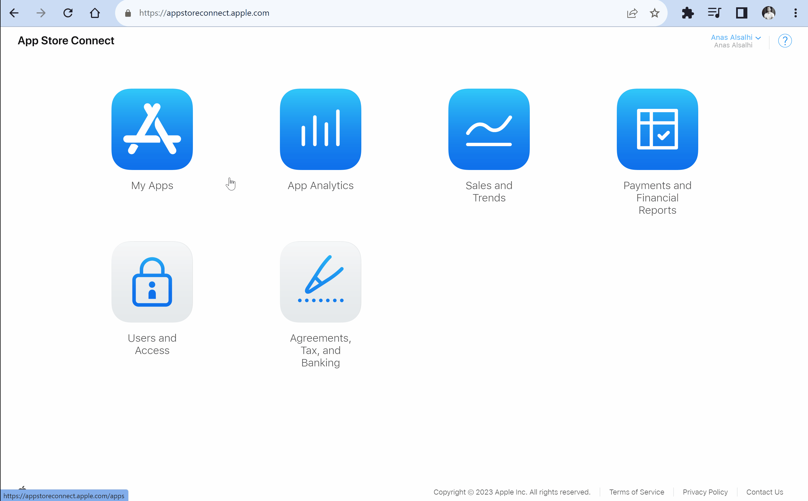
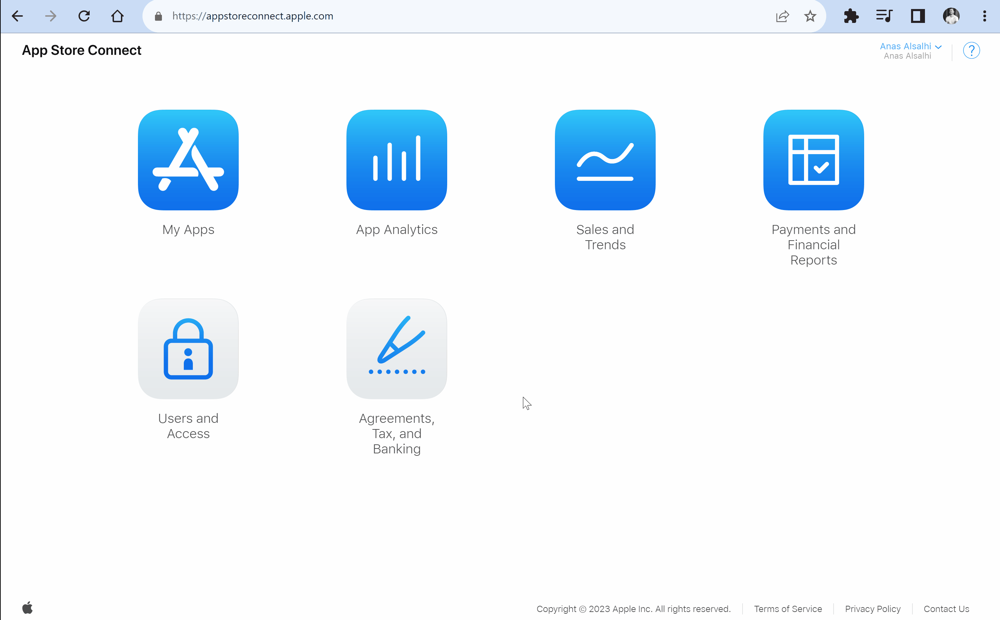

*In this guide you will learn:*

```
1. Join Apple developer membership 
2. Submit new App to the App store
3. Generate or use an Apple distribution certificate
4. Release new updates to your app automatically 
```


You've successfully built your brilliant app with Nowa, and now it's time to show the world your work. You're just a few steps away from deploying your application to the Apple App Store. Let's take a deep dive into how to smoothly deploy your application with Nowa and start reaching your iOS audience.

## Preliminary Steps

Before we kick off, there are some initial setup steps you need to undertake to pave the way for successful deployment.

1. **Create an Apple Account:** If you don't have an Apple account, you need to create one [here](https://appleid.apple.com/account?appId=632&returnUrl=https%3A%2F%2Fdeveloper.apple.com%2Faccount%2F).
    
2. **Enroll in Apple Developer Program:** Next, sign up for the [Apple Developer Program](https://developer.apple.com/programs/enroll/). This membership, which costs $99 per year, enables you to publish your Nowa-built apps to the App Store.
    
3. **Ensure your app's icon and package name are set:** If you don't upload a custom launcher icon, a default icon will be used. You can always update your app's icon later.
    

With those basics covered, you are ready to start the App Store deployment process.

## Deploying Your App

Here are the four steps you need to complete to deploy your app to the App Store for the first time. Afterward, Nowa will take care of future app updates automatically.

### Step 1: Create a Bundle Identifier

A Bundle Identifier is a unique identifier that distinguishes your app from all others on the App Store. The Bundle Identifier should exactly match your app's package name in Nowa. Follow the below steps to create your bundle identifier:

1. Go to your [Apple Developer Account](https://developer.apple.com/account).
2. Under **Certificates, IDs & Profiles**, select **Identifiers**.
3. Click on the **+** button to create a new identifier.
4. Select **App IDs**, then click **Continue**.
5. Select **App** and click **Continue**.
6. Enter the required information for your new Bundle ID:
    - **Bundle ID**: Use the same Package Name that your app has in Nowa.
    - **Description**: Provide a brief description of your app (this will be visible on the App Store).
    - **Capabilities**: Select the capabilities required for your app (for instance, if your app uses Apple Sign In or Apple Pay, ensure to check the corresponding boxes).

For instance, we created a bundle ID named `com.example.myfirstappwithnowa`, which matches the package name for our app in Nowa.


### Step 2: Create a New App in App Store Connect

[App Store Connect](https://appstoreconnect.apple.com/) is a platform you use to submit new apps to the store and manage their listings. Follow these steps to create your new app:

1. Go to App Store Connect and select **My Apps**.
2. Click on the **+** button next to apps, then select **New App**.
3. In the popup, fill in the following fields:
    - **Platforms**: Choose **iOS** for a mobile app.
    - **Name**: Enter your app's name as it should appear on the App Store.
    - **Primary Language**: Select your app's main language.
    - **Bundle ID**: Select the Bundle ID created in Step 1.
    - **SKU**: Enter a unique ID for your app. This won't be visible on the store. Typically, you can use the same Bundle ID here.
    - **User Access**: If your App Store Connect account includes other users, select who will have access to the app.

Click **Create** once you're done.

For example, we created an App named "My First Nowa App" using the bundle ID we created earlier (`com.example.myfirstappwithnowa`).



### Step 3: Generate an API Key

To enable Nowa to deploy your app to the App Store Connect account automatically, you need to generate an API key. Here's how:

1. Go to your **App Store Connect** account.
2. Select **Users and Access**.
3. Select the **Keys** tab.
4. Click on the **+** button to add a new key.
5. Name your key. This name is for your reference only.
6. Specify the access type associated with this key. Note that it should be either **Admin** or **App Manager** for Nowa to be able to deploy on your behalf.
7. Click **Generate**.
8. Download the API Key file. Keep it in a secure place as you can only download it once.

Remember, you will need the Key ID and Issuer ID for the next step.



### Step 4: Deploy Your App to the App Store

Now for the final step, deploying your app:

1. Open Nowa and select the **Settings** icon on the bottom left.
2. Choose **iOS Build**.
3. Enter your App Store Connect credentials (Key ID, Issuer ID, and API Key content).
	- For the Key ID and Issuer ID you can copy them from step 3 (**Keys** tab inside your App store connect account)
	- For the API Key content, open the API Key that was downloaded in Step 3 with any text editor, then simply copy and paste it's content in the field. 

5. For the **Apple Distribution Certificate Key**, you can either submit an existing private key to use an existing distribution certificate, or let Nowa generate a new one for you.

---

#### Understanding the Apple Distribution Certificate

The Apple Distribution Certificate is a critical piece of digital authentication that every developer or organization needs when distributing an app through Apple's various platforms. It verifies your identity, proving that the app comes from you and has not been tampered with since you signed it. Here's everything you need to know about it:

##### What is it?

Think of the Apple Distribution Certificate like a digital signature for your app. It ensures that you are the only one who can update or modify your app. It's used across iOS, iPadOS, macOS, tvOS, watchOS, and visionOS, allowing you to sign any app, for any of these platforms.

##### How is it used with Nowa?

Nowa offers you two choices. You can either use an existing Apple Distribution Certificate available in your Apple Developer account, or you can let Nowa generate a new one for you.

##### How is it usually created?

Typically, an Apple Distribution Certificate is created by making a Certificate Signing Request (CSR) from your Mac. This process generates a private key associated with the certificate. You then upload the CSR to your Apple Developer account to generate the Apple Distribution Certificate.

##### How to use an existing certificate?

If you already have an Apple Distribution Certificate, select the **Upload a key** option in Nowa. Then copy and paste the private key value associated with your certificate (open the private key file with a text editor and copy and paste it's content to the field, the same way you did with the App store connect private key). Nowa will then automatically use the private key to pair with the correct Apple Distribution Certificate that's already in your account to sign your app.

##### How to generate a new certificate?

If you don't have an Apple Distribution Certificate, select **Generate a new key** in Nowa. This process creates a new certificate in your Apple Developer account. Once created, you can download the private key associated with the certificate so you can use that same certificate to sign other apps, or you can delete the private key generated by Nowa, note that deleting the key inside Nowa only removes the private key from Nowa servers, but not the entire certificate from your Apple Developer account. To remove the complete certificate, navigate to **Certificates** in your Apple Developer account, choose the certificate, and click **Revoke**.

:::warning
Apple limits you to a **maximum of three certificates in your account.** If you reach this limit and choose to generate a new key in Nowa, **your app signing will fail during the build process**.

For this reason, we recommend using a single certificate to sign all your apps. If several developers share the same account, each can use their own certificate up to the maximum of three. If you have more than three developers, we recommend sharing certificates between developers.
:::

:::caution
It's crucial to use the same certificate for all updates to your app. If you try to push an update using a different certificate, it will be rejected. Whichever certificate you use to push the first version of your app, be sure to continue using that one for all updates.
:::

---


6. After you've entered all the necessary details in the Build panel, start the build process by clicking on **Build**. This process comprises several steps, including **preparing, fetching, building, and publishing.** 

The time it takes to build the app depends on server demand. On average, it takes about 6 minutes, but it can take up to 40 minutes during periods of high demand. Once the build process is complete, several files are generated. These include the app file (AppName.ipa) and various log files.

The completed app is automatically published to your app profile. You can confirm this by visiting your app profile in your App Store Connect account and checking the **TestFlight** tab. Here, you'll see your app build (version number 1.0.0 and build number 1, in this example) submitted.

Apple will then process the app build, which can take up to an hour. During this time, the state of your app build inside TestFlight tab will change from "**Processing**" to "**Ready to submit**".


#### Profile Completion and App Review

The final step is to complete your app profile. This includes writing a description of your app, uploading screenshots, and other necessary details. Once this is done, you can publish your app to the App Store.

Keep in mind, Apple will review your app before it becomes available to users. According to Apple, 90% of app submissions are reviewed in less than 24 hours.

**Congrats 🎉Your first app is now live on the store and ready for your users to use and enjoy!**

---

### How to Update Your App

When it's time to make changes to your app, you don't need to go through all these steps again. Here's how you update your app:

1. Make the necessary changes to your app in Nowa.
2. Increase the version number and optionally the build number of your app in Nowa. The version number is what users see on the App Store, and the build number is used internally for each upload. You can't upload an app with the same build number as an already uploaded version.
3. Once your changes are ready, simply go back to Nowa, to the **Settings > iOS Build** and click on **Build** again. Your previous infomation should be already saved so you don't need to do anything here, also be sure you don't change the distribution certificate that you used in the first time to be able to push new updates to your app 

After the build is complete, you'll see it in your App Store Connect account under the **TestFlight** tab. You'll find it under the **Build Activity** section with the new build number. Once it's done processing, hit **Submit** to send your updated app for review. After approval, the new version of your app will be live on the App Store.

Congratulations! Now you know how to deploy your Nowa app to the App Store and how to release updates. We hope you found this tutorial helpful. For any questions, please contact us on team@nowa.dev or using our discord server, and we will be always happy to help.
