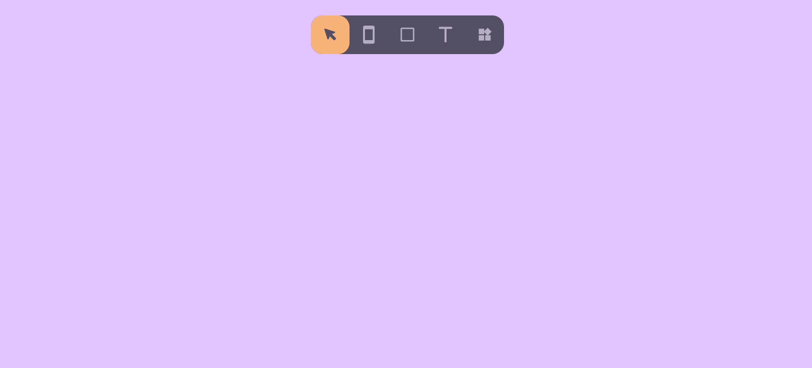
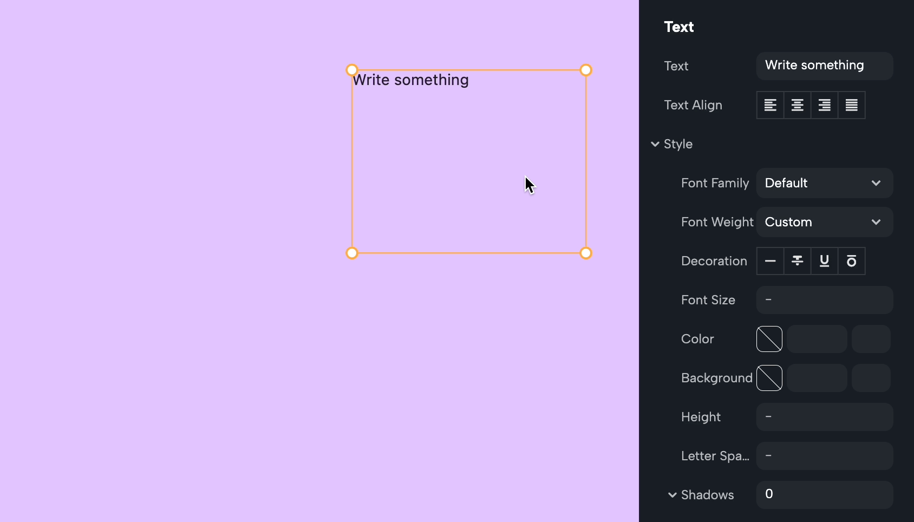
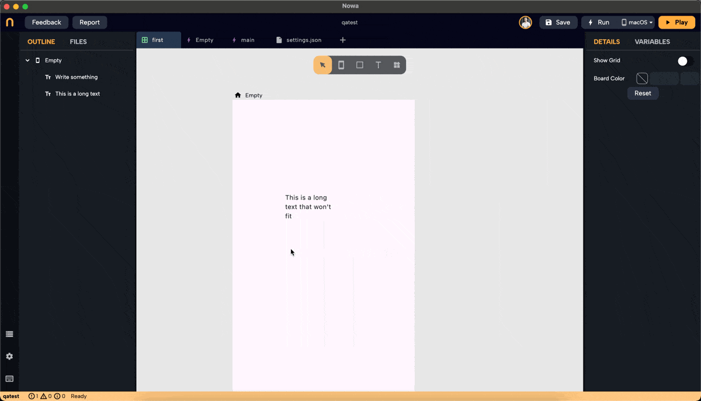

*In this page, you will learn:*

```
How to add a Text Widget using various methods.
Setting size parameters for your text widget.
Customizing the appearance and properties of your text.
Connecting text properties to Variables for dynamic changes.
```

Text is a crucial part of the design of your app. Nowa give you the flexibility to add a modify the text to meet your needs.
## Adding the text widget

Let's see together how to add the text widget:

- Select the Text Widget in the tool bar.
- Or, press the "T" key to use the Text tool keyboard shortcut.

Once you have the **Text tool** selected, you can add text to your screens or the board. You can do this action in two ways:

- **Single Click**: Click on the screen to add text. This will create a Text Widget with the Width and the Height set to "Auto". (Discover more about the [Layout](../../layout/)).

- **Click and Drag**: Click and drag the text tool on the screen to create a text widget with Width and Height to be set on "Fixed". (Discover more about the [Layout](../../layout/)).




💡 You can also add the Text Widget from the widget picker: in this case the width and the height will be set on "Fixed".

## Text Properties

Let's have a look together at the properties of the text widget that will help you achieve the look that you desire for your app:

- **Text**: In this field, you can modify what text is displayed.

- **Text align**: Change the alignment of the text, you can choose between: Left, Center, Right and Justify.

- **Font Family**: Select the Font family that you want your text to be displayed with. You can add custom fonts by dragging and drop the font file inside Nowa, or insert it through the Files window.

- **Font weight**: Decide the thickness of your Font. The available options for the default font are: Thin, Extra Light, Light, Normal, Medium, Semi Bold, Bold, Extra Bold, Thick.

- **Decoration**: Decorate your text with the available options: Strikethrough, Underline, Upper Strike.

- **Font Size**: Type a number in this field to change the size of your text in the widget.

- **Color**: Choose from here the color you want you text to be displayed.

- **Background**: Add a color that will behave as a background for your text.

- **Height**: Change this number to determine the height of the space the text will occupy.

- **Letter Spacing**: Change this number to determine the space between the letters of your text.

- **Shadow**: Add shadows to your text to create depth.





- **Overflow:** Set how the text should behave when it exceeds the space available. The options include:
    - Clip: Clips the text that overflows the container.
    - Ellipsis: Adds an ellipsis (...) at the point where the text overflows.
    - Fade: Gradually fades the overflowing text.
    - Visible: Allows the overflowing text to be fully visible beyond the container's bounds.
    - To remove the overflow option, right-click on the property name `overflow` and choose `Reset to default`




💡 For more options, all the text properties can be connected to variables. For more. check out [Using Variables](../../../variables/local_variables/using_vars.md).

  


