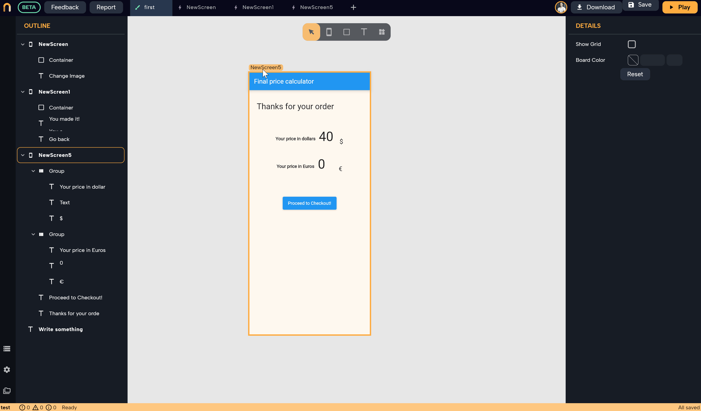

*In this section, you will learn:*
```
1. How to add logic to compute the value of widget properties automatically
2. How callbacks work in Nowa  
```

In Nowa, the **compute** option allows you to automatically calculate the value of a widget property using logic and/or other variables when the widget is loaded. This feature offers a quick way to set up property values without the need for tracking variable updates.

## How to Use Compute

1.  Click on a widget property and select the **compute** option in the popup next to other options such as creating a variable or connecting it to an existing variable.
2.  The compute option creates a callback logic, where the value is calculated through some logic and immediately returned to the property without having to create and update a variable. You will see the name of the callback being added. Click on it then choose **Open in circuit**.
3.  The compute function is executed initially while the widget is being loaded, so the calculated value will be already set for the widget property upon loading.

### Example: Calculating Price in Euros

Imagine you have an e-commerce app where you display the final price of the order in dollars and euros. The price in euros is the price in dollars multiplied by the exchange rate (e.g., 0.92). You can use the **compute** option on the text property of the Text widget that displays the price in euros:

1.  Assume you have a variable called **dollar** connected to the Text widget that displays the price in dollars. The value of this variable can be received from a previous screen that adds the price of all the orders together for example, and then the resulting sum is sent to this screen.
2.  To make the Text widget for the price in euros compute its value automatically, right-click on the text property of the Text widget and choose **Compute**.
3.  A callback named **createText()** is created. Click on it and choose **Open in Circuit** to open the callback logic.
4.  Add the **dollar** variable to the board and then add the **multiply** node, connecting them together.
5.  Manually enter 0.92 for the other input pin in the **multiply** node so it will multiply the value of the **dollar** variable by 0.92.
6.  Use the **toString** node to convert the number to a string before connecting the output of the **toString** node to the **Return** node, because the text field in the Text widget expects a value of type string.




Now, if we for example changed the default value of the **dollar** variable, the price in euros will be updated automatically. The price in euros will then compute its value while the screen is opening and will always be updated to be the value of the **dollar** variable multiplied by 0.92.