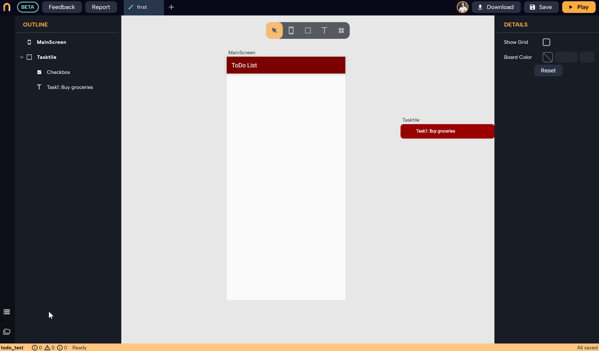

# Create Objects

On this page, you will learn:
```
1. What are objects
2. How to create objects
3. Use cases for needing to use objects
```

Objects play a crucial role in organizing and managing your data interaction inside your app. Let's see how to create them, use them, and see their practical application in some app scenarios.

## Understanding Objects:

Objects in Nowa can be thought of as envelopes that hold data under a single name. For example, a news object is an envelope that holds data related to a news item such as the title, date, image link, and content. 

This makes it much easier to group your data into a single object and pass it between screens in your app or between your app and an API. 

After creating an object, you can add data to it, and the receiver can then extract the required data from that object.

:::info
Check the example below for a To-Do list app to see exactly how creating objects is done
:::

## Creating an Object:

1.  Navigate to the Files section in Nowa.
2.  Click on 'Add', then select 'New Object'.
3.  Enter a name for the object.
4.  Define variables inside that object, which will define the structure for that object from now on. (Check out [Crating Variables](./local_variables/var_vs_param.md) for more information).
5.  Now, you have created an object blueprint with its variables inside. Now when you create an instance from that object, it will have this pre-defined structure (the names and types of variables inside it)

## Working with Objects in Circuits:

In Nowa's circuits, you can do operations on objects, such as creating instances, filling them with data, and passing them between screens or sending them via APIs. You can also add an instance of an object to a list of that object.

## Example - To-Do List App:

Consider creating a simple to-do list app where each task is an instance from an object called "task" with two variables: a string to hold the task name called "name" and a boolean to indicate if the task is completed or not called "isdone".




The logic will be as follows:

1.  When the user clicks on the 'Add Task' button, a new instance of the 'task' object is created with the text from the input field and a default value of `false` for the variable "isdone" .
2.  The new task object is then added to a list of tasks and the main screen UI will be updated with the recent tasks that will be displayed in a horizontal group(Raw). Check [Groups](../ui/layout/groups.md) for more details.
3.  As users add more tasks, the list of task objects grows, making it easy to manage and display the tasks within the app. The user can also add logic to a button inside each task to remove that task from the list.

In summary, objects in Nowa are a powerful way to organize and manage data within your app, enabling seamless interaction between screens and external APIs. By understanding how to create and work with objects, you can build a powerful structure that scales smoothly and make it easy to build advanced functionalities and organize the flow of data inside the app.


